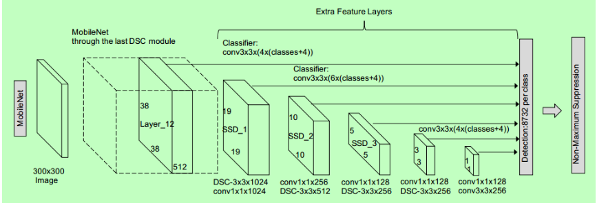

# Multi Object Tracking Using MobileNet SSD 

Implementation of Multi Object Tracking using a pretrained MobileNet SSD with dlib library and OpenCV in Python.

## Multi Object Tracking:
Multiple object tracking is the task of tracking more than one object in the video. In this case, the algorithm assigns a unique variable to each of the objects that are detected in the video frame. Subsequently, it identifies and tracks all these multiple objects in consecutive/upcoming frames of the video.

## SSD MobileNet Architecture:
The SSD architecture is a single convolution network that learns to predict bounding box locations and classify these locations in one pass. Hence, SSD can be trained end-to-end. The SSD network consists of base architecture (MobileNet in this case) followed by several convolution layers:



By using SSD, we only need to take one single shot to detect multiple objects within the image, while regional proposal network (RPN) based approaches such as R-CNN series that need two shots, one for generating region proposals, one for detecting the object of each proposal. Thus, SSD is much faster compared with two-shot RPN-based approaches.


## Output


## Requirements :

- dlib
- opencv-python
- imutils

## Usage :

- Clone this Repository
```
git clone https://github.com/ayanbag/Multi_Object_Tracking_with_MobileNetSSD.git
cd Multi_Object_Tracking_with_MobileNetSSD
```
Then run the following command to install the required dependencies.
```
pip install -r requirements.txt
```

- Now excute the following command :

```
python multi_object_tracking.py -i <path-to-input>
```


**Note:** Our script processes the following command line arguments at runtime:

- `--input` or `-i` : The path to the input video file. We’ll perform multi-object tracking with dlib on this video.
- `--confidence` or `-c` : An optional override for the object detection confidence threshold of 0.2 . This value represents the minimum probability to filter weak detections from the object detector.
